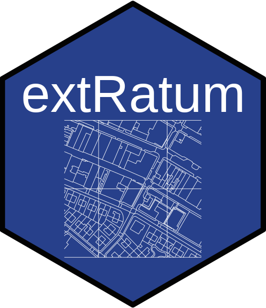

## Overview

extRatum is a package which summarises the presence of geospatial features in larger geographic areas. It does so by calculating the area covered by a geospatial feature (i.e. buildings, parks, lakes, etc.). The geospatial features can be of all types of geospatial data (i.e. point, polygons or lines).


## Installation
The easiest way to get extRatum is to install it from CRAN:

```{r, eval = FALSE}
#install.packages("extRatum")
```

### Development version

To get a bug fix or to use a feature from the development version, you can install 
the development version of extRatum from GitHub.

```{r, eval = FALSE}
# install.packages("devtools")
#devtools::install_github("patnik/extRatum")
```

## Usage


